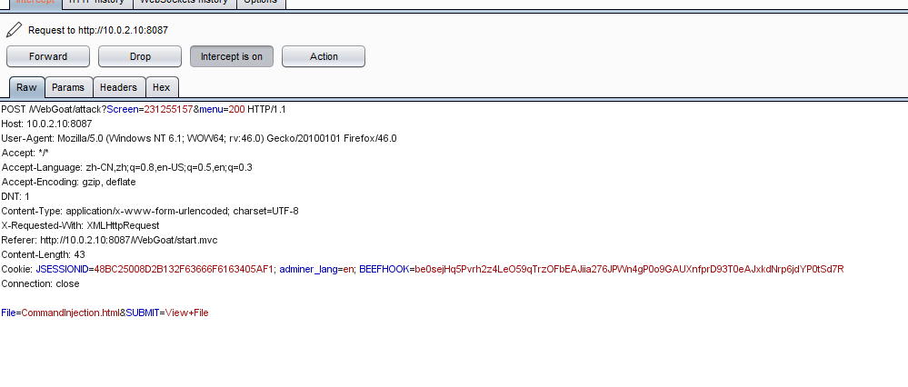
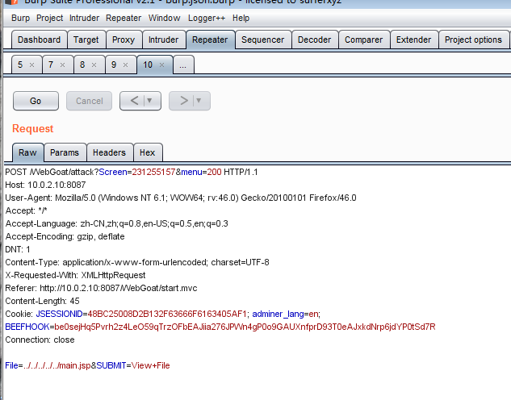

###Bypass a Path Based Access Control Schema

>1 选择一个目录进行访问 

    提示 是否 被 允许 

   allow directory   

>2 ,用  burpsuit  抓包  查看 request 请求 

>3 把 request 包 send to repeater 模块  
 
修改  请求正文的  file 参数   File= ../../../../../main.jsp 

>4  response 包显示  访问 被允许 

路径被绕过 ！！Congratulations! Access to file allowed

