## Linux 常用命令

+ 修改主机名

```bash
#  test为修改后的主机名

hostnamectl set-hostname   test
```


+ 修改为主机名 还需要修改 **/etc/hosts** 文件 

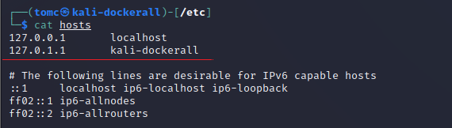

+ 查看文件安装目录
  
```bash
dpkg -L vim
```


+ grep 
  
```bash
# 后接相应参数
grep -B    grep -A   grep -i   grep -n  grep -c
```


+ 查看系统版本几种方法
  
  ```bash
  # 针对ubuntu 系统 全部可用， 其他系统自行尝试
   cat /etc/issue 
   cat /etc/os-release
   cat /etc/lsb-release
  ```

+ man的几种方式

```bash
# 数字3 可为1- 9中的数字（需按实际替换）
man 3 pcre
```


 man 7 查看后 按q 退出 ，会提示还有可看文档  如果查看 按 回车 ，否则，按quit 退出

 

 + 进程常用指令
  
  ```bash
  ps aux  
  pstree  
  pidof  
  top
  htop
  kill/kill -9 / kill -s N /killall <process_imagename>   
  ```

  

  + scp
   
  ```bash
  #scp  源目标   目的目标 
  # 把远程主机10.0.2.14上的test文件 ，拷贝到本地 根目标  
  #注意 冒号  和 空格 

  scp tomc@10.0.2.14:/home/tomc/test ./
  ```

  

  + tail 时时监听syslog 日志

```bash
tail -F /var/log/syslog
tail -F /var/log/auth.log
```


+ Linux 系统中解压 来自Windows的压缩文件 乱码问题  

```bash
# 添加 大写字母O cp936 即可实现转码显示

unzip -l test.zip
unzip -O cp936 -l test.zip
```


### **配置免密登陆方法:**

1、本地主机生成公钥文件

```bash
ssh-keygen -b 4096

```

- 公钥存储目录

     ~/.ssh/id-rsa.pub

- 使用终端 `ssh-copy-id`命令 把本地公钥发送 远程主机 

```bash
ssh-copy-id -i ~/.ssh/id_rsa.pub tom@192.168.0.10
```
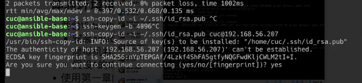

### **root 用户设置免密登陆**

- 首先在远程主机 root 家目录 新建  .ssh 目录

```bash
sudo mkdir /root/.ssh
# 把远程tom 用户家目录下的 authorized_keys 文件 拷贝到 /root/.ssh 下
sudo cp /home/tom/.ssh/authorized_keys /root/.ssh/authorized_keys
```

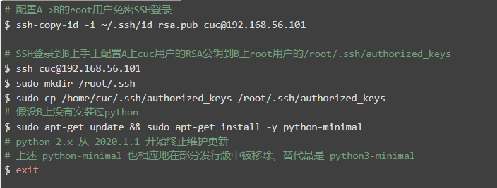

- 使用指定 源更新 安装软件方法

```bash
#使用国内 pypi 镜像加速下载
pip3 install ansible -i https://pypi.tuna.tsinghua.edu.cn/simple
#验证 pip 方式安装的 ansible 版本
pip3 freeze | grep ansible
```
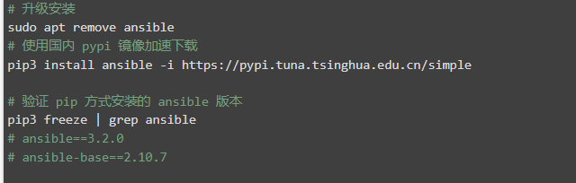

- 使用 pip freeze 查看安装版本

```bash
pip freeze | grep requests 
```

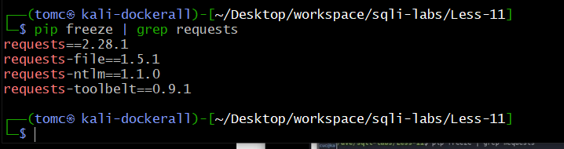

- 修改本机 hosts 文件  添加  域名指定未被污染的IP地址

```bash
# 可以通过 ipip.net或者其他网上在线查找工具，查找访问域名对应的无污染IP 
 vim /etc/hosts
 cat /etc/hosts
```
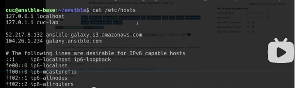

- 查找 配置文件是否使用的80 或者 8088 端口方法：
 
```bash
# 当前目录 搜索 所有文档中 是否 含有 80  ，递归方式
grep 80 -R .. 
grep 8088 -R ..
```
 
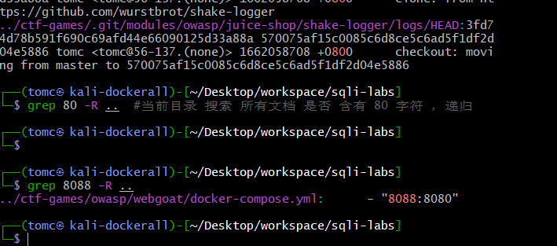

- ps aux 中 STAT 所对应参数含义：

          D --不可中断 Uninterruptible sleep 通常未 I/O ,

          R  -- 正在运行 或者在队列中的进程，

          S  -- 处于休眠状态，

          T  -- 停止或者被追踪，

          Z  -- 僵尸进程，

          W  -- 进入内存交换（从内核2.6开始无效），

          X  -- 死掉的进程，

          <  -- 高优先级，

          N  -- 低优先级，

          L  --有些页被锁进内存，

          s  -- 包含子进程，

          +-  --位于后台的进程组，

          l   --多线程，克隆线程：，

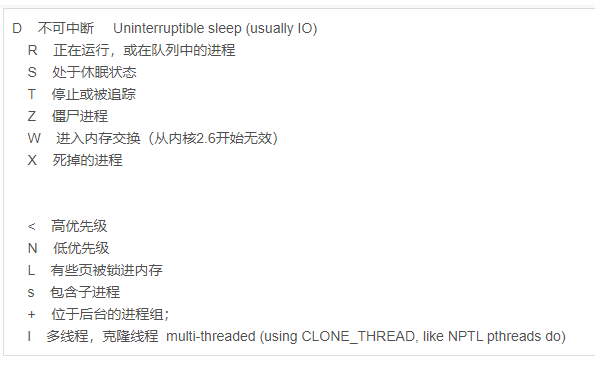

- 如何验证一个中文汉字 是三个字节 

```bash
# 中字 e4b8 ad   文字e6 9687
echo -n '中文'  | xxd
```

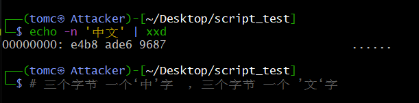

- bash 脚本第一行 书写方式

```bash
#! /usr/bin/env bash
# cat -n查看 
cat -n 2-3.sh
```

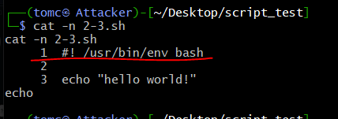

- 日期格式转换显示 

```bash
date -d "$date1" +%A
# 日期转星期
date -d "sep 18 2022" +%A
```

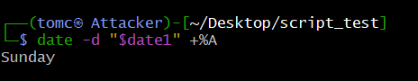

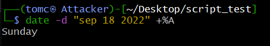

### ****进程相关命令**


+ 进程查询 `ps  | grep`  `lsof -p 进程号


```bash
#查看当前shell 进程号
 ps | grep $$

#查看指定进程号的 进程状态
 ps aux | grep 8798

#bash 进程的绝对路径
 type bash

#bash的 版本
bash --version 

lsof -p pid
```

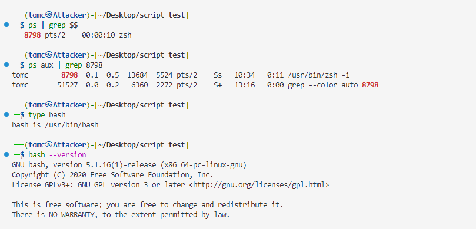

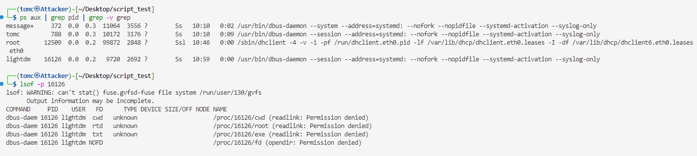

+ grep 查询 已知文件内包含 所查内容 


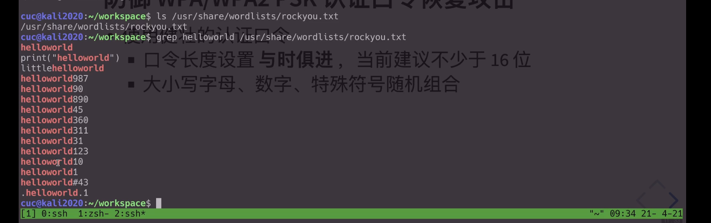


+ Bash 脚本 调试模式

```bash
#命令行 -x 进行脚本逐行调试，并打印输入的参数值
 bash -x <script.sh>
# 代码片段临时开启调试模式 (开始：-x，结束：+x)
 set -x
 w
 set +x
# echo -n -e 包括不可打印字符 参数写文件 >> 追加
 echo -n -e "$msg" | xxd -p >> /tmp/debug.log
```

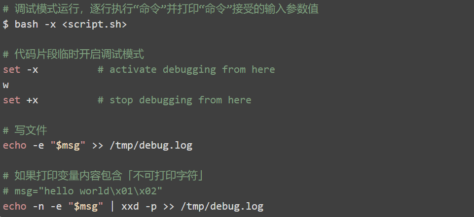

+ 显示列表命令 `ls` ,查询命令`find`

```bash
# 按时间排序 查看最近10条 
 ls -alt | head -n 10
#查找24小时内，新建的所有 .jsp 文件
 find ./ -mtime 0 -name "*.jsp"
#同上
 find ./ -mtime 0 -name "*.sh"
# 查找所有.sh 权限问777的所有文件
 find ./*.sh -perm 4777
```

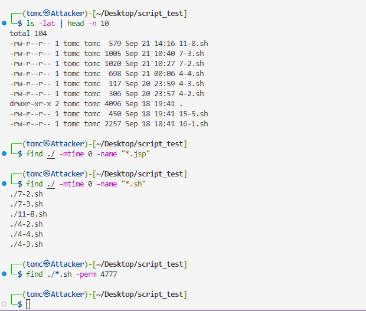

+ 命令`ls -at`

```bash
 ls -at /tmp | grep $(date)
 ls -at /tmp | grep "$date"
```

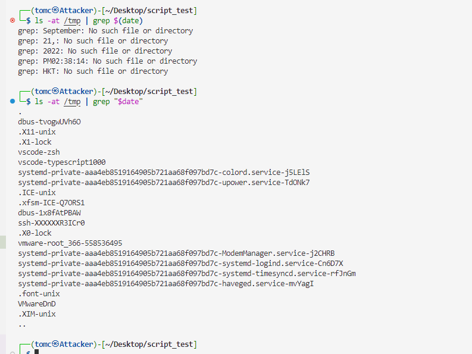

+ 查看用户信息 命令 `last`

```bash
 last
```

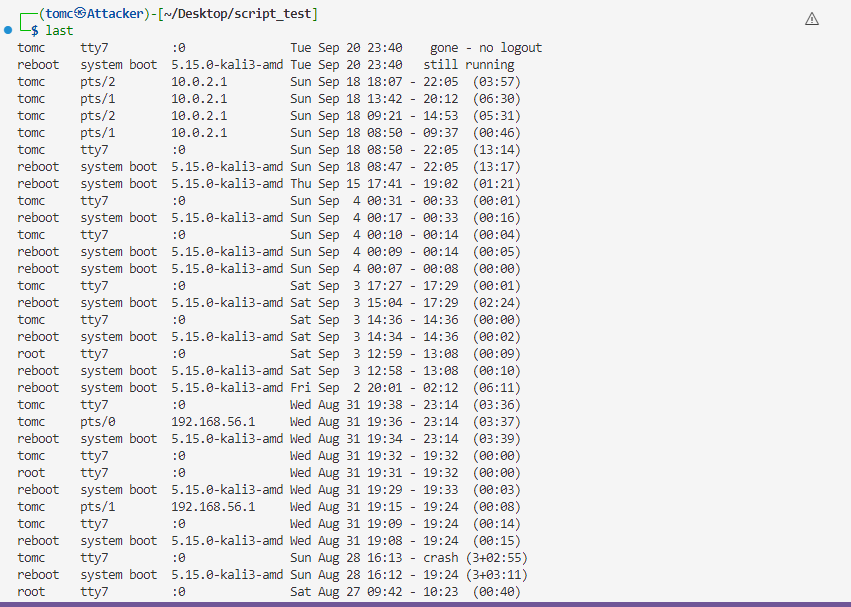

+ 查看系统中所有用户最近一次登陆消息 命令 `lastlog`

```bash
 lastlog
```

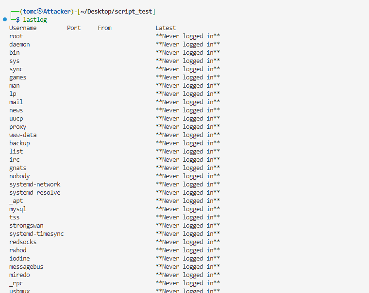

+ 查看用户错误的登陆列表  `lastb`

```bash
 lastb
```

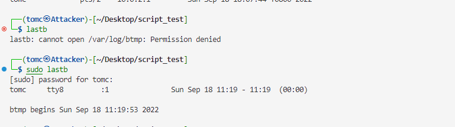

+ 查看用户登陆时间 命令 `uptime`

```bash
 uptime
```

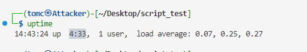

+ 查看当前用户 命令`w` ， `who` ，`whoami` ， `users` 

```bash
 w 
 who
 whoami
 users
```

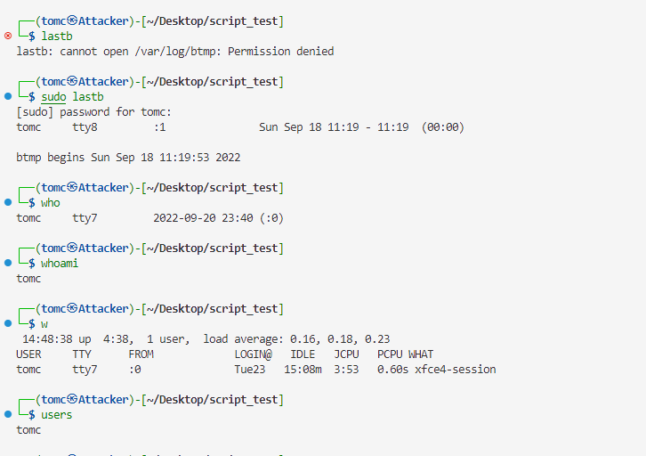

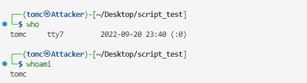

+ wc -l 计算文件内多少行 

```bash
wc -l
```

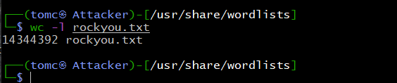


+ 解压缩命令：

+ “文件”的解压缩命令 有两种 ：

+ `gzip` +   （.gz结尾）

  +  `gzip`+文件名称    ---- 压缩文件 

  + `gunzip`  压缩包     ----解压缩

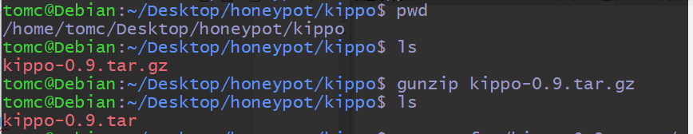


+  `bzip2`    （.bz2结尾）

  + `bzip`+ 文件名称   ---- 压缩文件

  + `bunzip2`+ 压缩包    --- 解压缩

+ “目录”进行打包压缩 命令：

  + （对.tar  包 进行 解压缩 操作 ）
```bash
tar -xf  xxx.tar  -C /root 

 -x 解压缩 tar 包。  -C（大写）  指定 解压缩后目录存放路径 

对 （*.tar.gz / *.tar.bz2 ）两种压缩文件进行 压缩 / 解压缩 操作 
```
+ 1、 *.tar.gz   
    +  压缩：  
`tar  -zcf  压缩后文件路径名称    被压缩的目录`

    + 解压缩：
`tar -zxf  被解压缩的压缩包    解压后存放路径`( -C 指定存放目录)

+ `tar -zvxf   *.tar.gz   `   显示所有文件  信息


+ 2、 *.tar.bz2 
	  
    +  压缩：
  `tar  -jcf 压缩后文件路径名称（*.tar.bz2） 被压缩的目录`

	+   解压缩：
     `tar -jxf  被解压缩的压缩包（*.tar.bz2）  解压后存放路径` ( -C 指定存放目录)   


+  总结： 

	`-z `     用于  zip  
	`-j `  用于bzip2


+ 分布进行：
     （*.tar.gz）源码包

 	1、 `gunzip   *.tar.gz  `   [-C  路径]
	
  2、 `tar -xf  *.tar    `  [-C  路径]

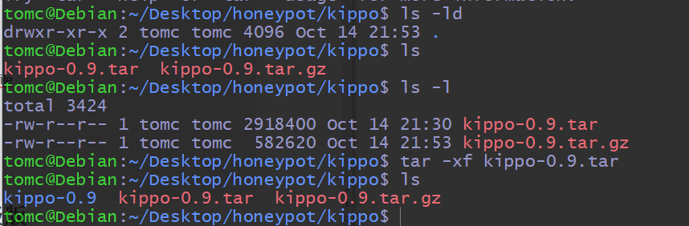

 + `ls /ls -l/ls -lh 目录 / ls-lhd `
 
 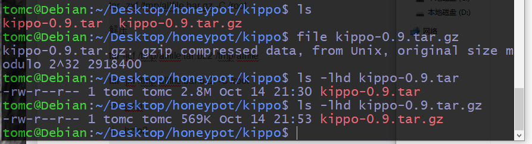

 +  （显示目录内文件大小 /显。示文件目录内容/ 查看目录内容及大小（人类可读方式）/ 查看当前目录大写 ）


+ `du -sh`  目录       查看当前目录内文件大小  （统计查看目录）

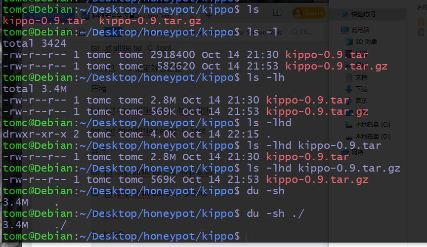

+ `file 文件名称`  ：分析文件类型

+` find / -name 名称` 按文件名查找

+ `apt search 文件名称 `  搜索文件包

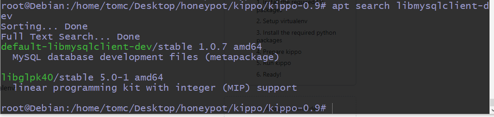

+ `hash-identifier`  hash 识别

+  `hashcat`  hash 破解

+ `strings `  字符串形式查看内容

+ `binwalk`  查看是否有捆绑

+ 常用字典/usr/share/wordlists/rockyou.txt

+ github 下载 tar包，通过scp 从宿主机拷贝到 虚拟机，Debian11 指定位置， 

+ `tar -zxf *.tar.gz    目录
`

+ docker 安装  ：

https://docs.docker.com/engine/install/ubuntu/

安装操作文档一步一步执行即可   ，注意platform

+ 

+ docker 官方：
docker-ce 

+ Ubuntu官方：（kali内置）
docker.io

```bash
apt update && apt install docker.io python3-pip    [-y] 参数
```
安装完检查 ：
```bash
sudo systemctl status docker     查看dockers状态

sudo docker images  		查看 镜像文件
```
+ docker 默认管理员权限 

+ 修改权限 ：

+ 查看 当前用户属性 `id`

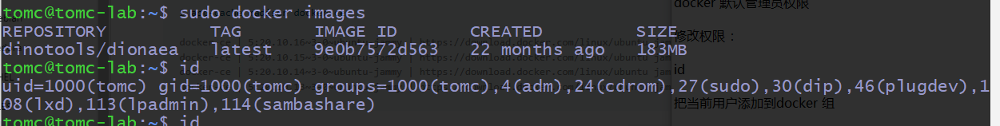

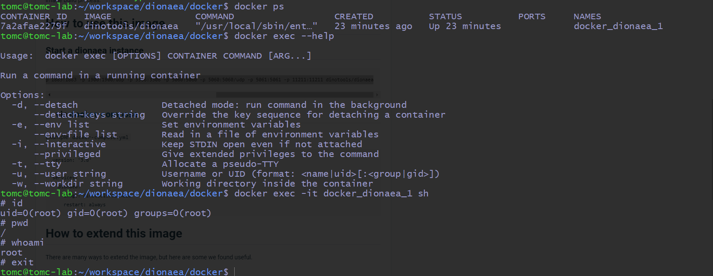


+ 把当前用户添加到docker 组

```bash
sudo usermod  -a -G docker tomc 
```
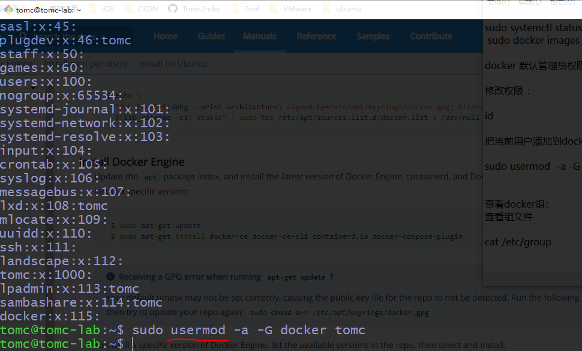

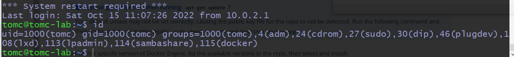

+ 添加后重新登陆


+查看docker组：
 查看组文件

```bash
cat /etc/group
```
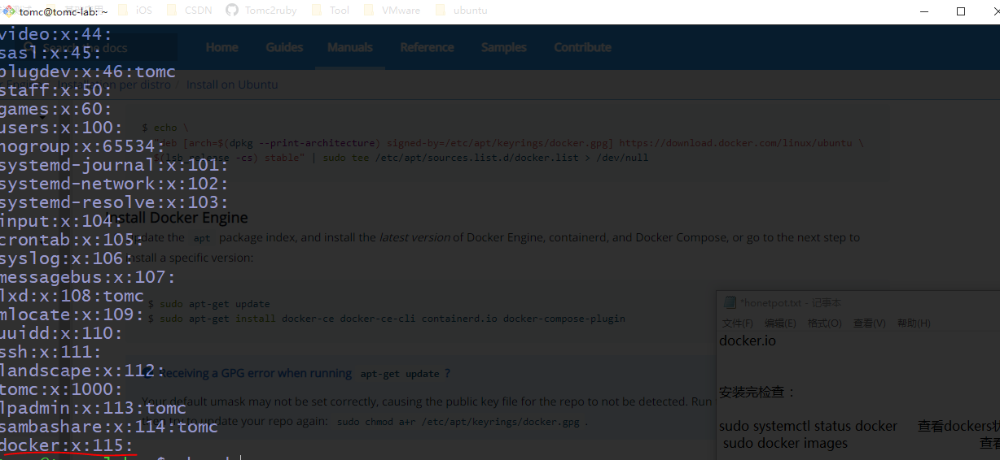

```bash
docker help /docker help push  #  查看命令 帮助

tldr docker    # 查看常用参数
```

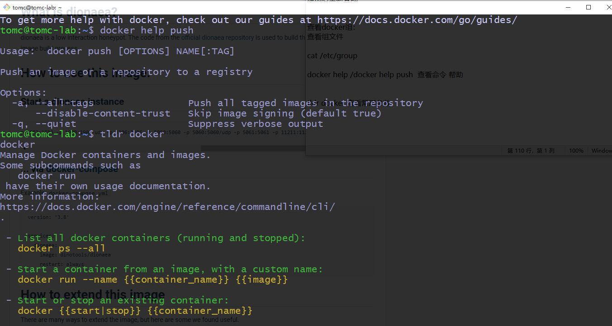

```bash
docker version  #  查看docker版本 

```
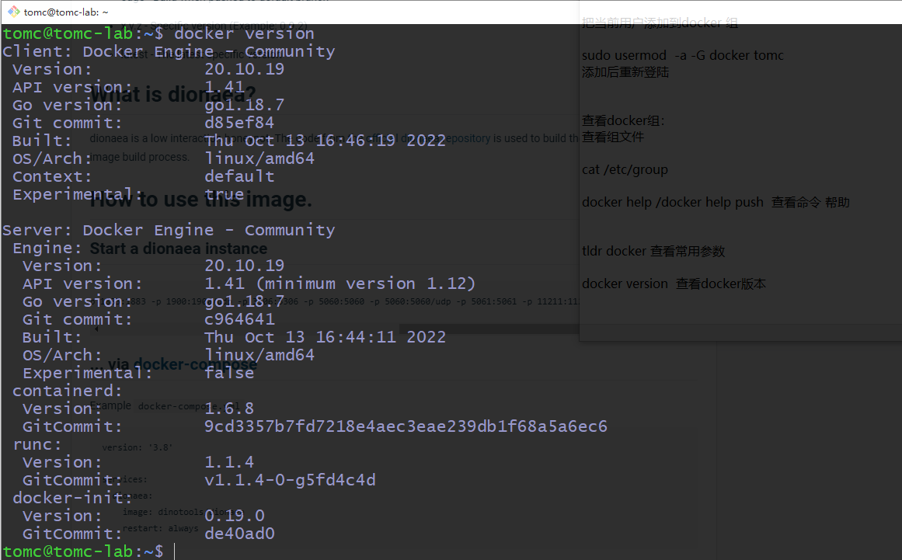

+ docker命令简单分类整理助记忆：

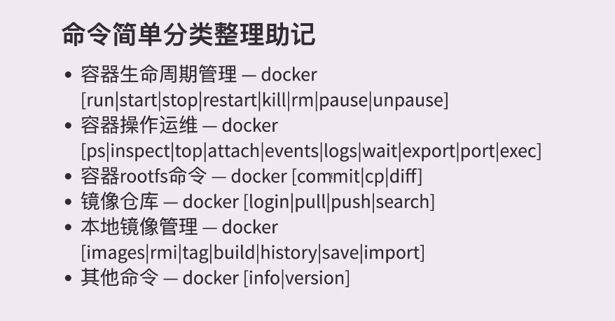

+ 安装pip3 

```bash
sudo apt  install python3-pip
```

+ 安装 docker-compose  

```bash
which docker-compose     #  查看是否已安装
apt policy docker-compose    #   查看可安装版本 
```
```bash
apt search docker-compose  # 搜索可用版本 
```
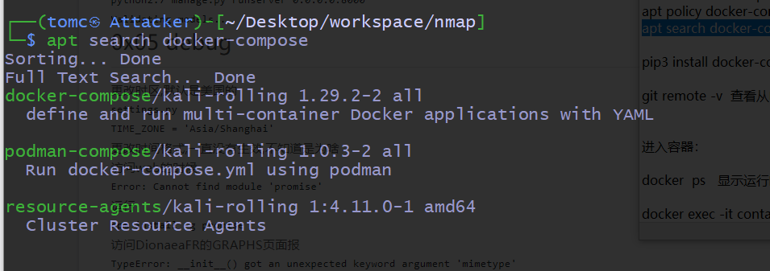


```bash
pip3 install docker-compose     #  用 python3中的 pip3  进行安装  
```
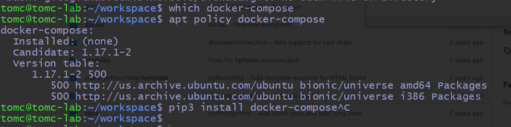

```bash
git remote -v   #  查看从哪里clone的镜像   
```
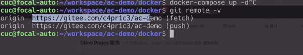


+ 进入容器：
```bash
docker  ps   显示运行的容器

docker exec -it container(名称) bash     进入容器内部  
docker exec -it container(名称) sh
```

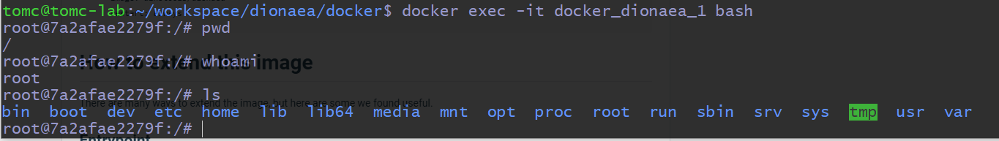


+ 查看当前所有可用shell 及位置

```bash
cat /etc/shells
```
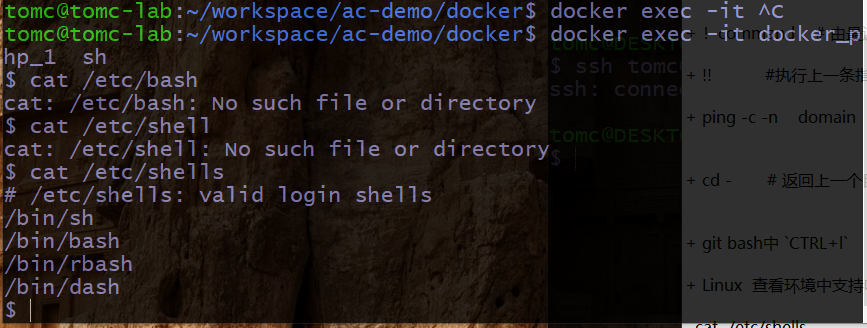


```bash
docker history   dinotools/dionaea（镜像名）  -- no --trunc          #反向解析 build过程  （不进行截断）
```
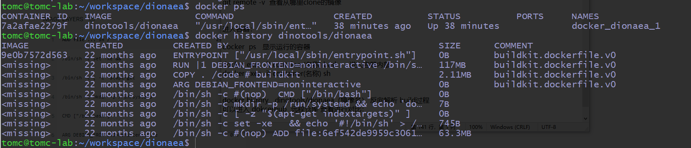

+ 可以进入 dokcerhub  远程仓库 查看进行对比：

```bash 
 docker run --rm -it  镜像名称  bash    #  进入 交互式镜像环境，PHP 
```
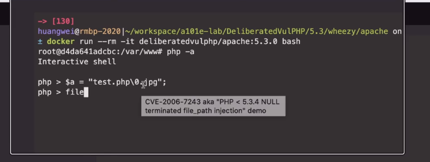


```bash
docker cp 容器名称（ID）：路径/文件名称     ./(当前路径)                 # 从容器中copy 文件到宿主机 
 ```
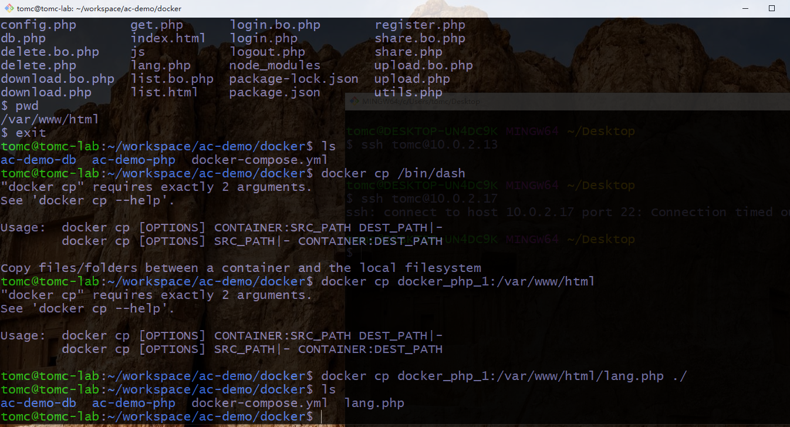


+ history   #查询历史命令
```bash
!number  # 执行第number个 历史命令

 ！command    # 由最近命令向前搜索 指令以command  开头哪个指令 并执行` ！！`
 ```
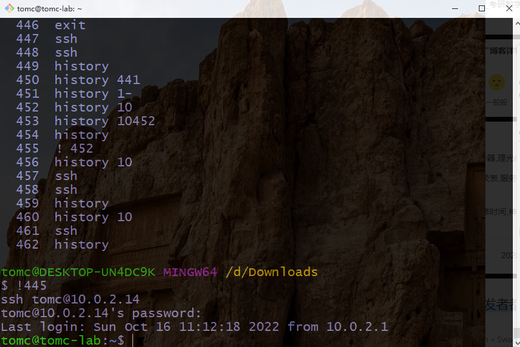

```bash
 !!     	#执行上一条指令 ，相当于 按上建后 按 enter
```


+ ` ping -c -n    domain`     # ping 包数 、不解析

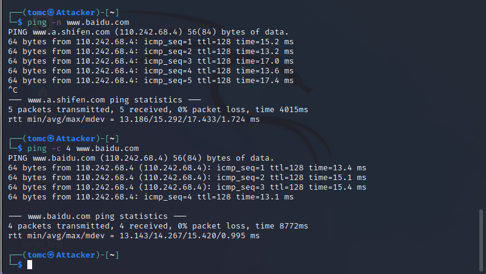

+  `cd - `      # 返回上一个目录   ， 不小心 输入了 cd  回到了 根目录， 想返回之前的目录   就用此命令

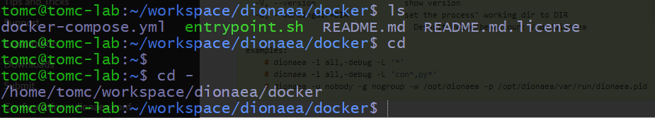

+  git bash中 `CTRL+l`     # 清屏      

+ Linux  查看环境中支持哪些 shell
```bash
  cat  /etc/shells  
```

+ kali 系统 ： machine-id   重置方法：
```bash  
  cat  /etc/machine-id
  cat /var/lib/dbus/machine-id
   # 此两处 machine-id  值需要一样 ，避免出现不必要的麻烦  

  sudo rm  /etc/machine-id  /var/lib/dbus/machine-id

# 重新生成 
  # 当文件machine-id 内容为空或者文件缺失时 ，创建   /var/lib/dbus/machine-id
 并写入 /etc/machine-id
 ```
 ```bash
   sudo dbus-uuidgen  --ensure
   sudo  systemd-machine-id-setup
```
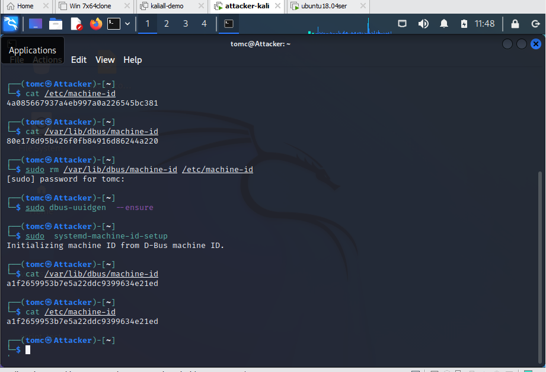


+ lsof   
```bash
列出所有打开的文件
lsof abc.txt 
显示开启文件abc.txt 的进程

lsof 目录名 
# 查找谁在使用文件目录系统 

lsof -i: 22
# 列出谁在使用22 端口

lsof -i udp: 22
# 列出谁在使用某个特定的UDP端口

lsof -i
# 列出所有的网络连接

lsof -p 12
# 看进程号为12 的进行打开了哪些文件
 
lsof -u username 
# 查看某用户打开哪些文件

```
```bash
lsof -i 4 -P -n -L  # TCP方式，显示PID name 是否被listen 
```
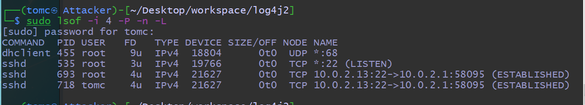

+ EOF 本意是 End Of File，表明到了文件末尾。

 ”EOF“通常与”<<“结合使用“   ：非交互式追加或修改
 
 <<EOF“表示后 续的输入作为子命令或子 shell 的输入，直到遇到”EOF“，再次返回到主调 shell，可将其理解为分界符（delimiter）。既然是分界符，那么形式自然不是固定的，这里可以将”EOF“可以进行自定义，但是前后的”EOF“必须成对出现且不能和 shell  命令冲突。

 cat <<EOF>>  ./test1.php
   hello world
   123
   EOF

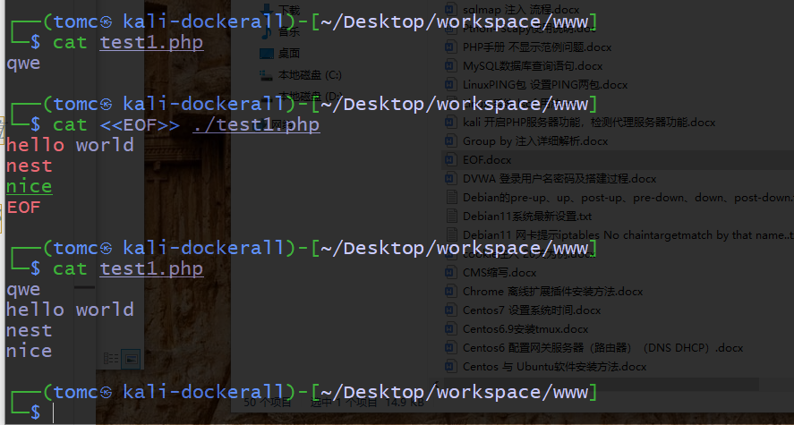

+ ping

+ 特别注意  一个尖括号是 覆盖
```bash
  cat <<EOF> /etc/hosts
  10.0.2.26    wordy
  EOF
```

```bash
ping -c2 -i0.2 -W2 192.168.1.1 &> /dev/null

  # ping 两包，时间间隔0.2秒 等待时间2秒
```
+ php开始临时服务

```bash
Php –S 0.0.0.0:8080  # 开启PHP 服务 同时监听 8080 端口 
```
+ Python 开启临时Http服务

```bash
命令：
Python3 -m http.server
```
     注意：当前目录即为  HTTP服务的根目录 ,通过 HTTP 访问 即为  开启命令时 所在的文件目录  位置

+ curl 添加代理请求头

```bash
Curl “ X-Forwarded-For:8.8.8.8” http://127.0.0.0:8080 参数： (-v /-vv)
```


+ Tmux 快捷键 ：

	+ 现按 Ctrl+b 松开后    按 “   ：为上下分屏     + (shift+')
	+ 现按 Ctrl+b 松开后    按 d   ：为任务后台运行
	+ 现按 Ctrl+b 松开后    按 s   ：列出所有会话
	+  现按 Ctrl+b 松开后    按 ；  ：光标切换到上一个窗口
	+ 现按 Ctrl+b 松开后    按 o  ：光标切换到下一个窗口
	+ 现按 Ctrl+b 松开后    按 [  ：窗口上下翻页  (按ESC 退出)

+ tmux ls   列出所有任务 
+ tmux switch –t 0   切换会话 
+ tmux kill-session –t 0 杀死会话
+ tmux attach –t 0  从新会话

+ Window终端操作：
    + Ctrl+l 清屏 
    + Ctrl+b w 查看几个子窗口 

创建一个窗口：

    第一步：按 Ctrl+B 组合键，然后松开。
    第二步：再单独按一下 c 键

在窗口间切换
既然，我们在 roclinux 这个 session 中已经有了两个窗口，那么如果想在两个窗口间进行切换，应该怎么操作呢？

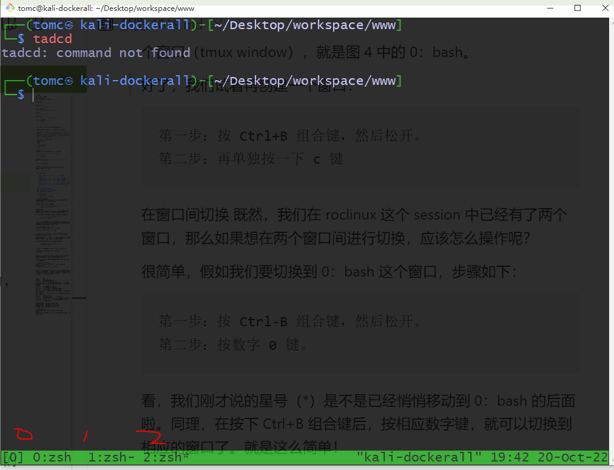

很简单，假如我们要切换到 0：bash 这个窗口，步骤如下：

    第一步：按 Ctrl-B 组合键，然后松开。
    第二步：按数字 0 键。


看，我们刚才说的星号（*）是不是已经悄悄移动到 0：bash 的后面啦。同理，在按下 Ctrl+B 组合键后，按相应数字键，就可以切换到相应的窗口了。就是这么简单！

+ 4.退出会话，还能再回来
现在，我们切换到 0：bash，运行一个命令：

[root@roclinux ~]# watch -n 2 free


这个命令会每隔 2 秒钟更新一次内存使用状态，如果不输入 Ctrl+C，则永远不会退出。

假如这时候你要带着办公电脑去开会，你的电脑要断网，又不想中断服务器上正在执行的 watch 命令，怎么办呢？

哈哈，tmux 正好可以派上用场，方法是这样的：

    第一步：输入组合键 Ctrl+B，然后松开。
    第二步：输入字母 d。


看，tmux 环境消失了！眼前只有一行提示 [detached]：


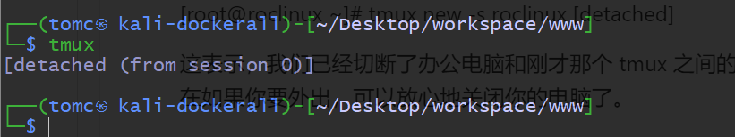

+ 这表示，我们已经切断了办公电脑和刚才那个 tmux 之间的桥梁。现在如果你要外出，可以放心地关闭你的s电脑了。

+ 当你回到家后，打开电脑，连接到你的那台远程服务器，然后执行一个神奇的命令：

``` bash
[root@roclinux ~]# tmux ls
roclinux: 2 windows (created Fri Jan 22 16:30:13 2016) [130x36]
[root@roclinux ~]# tmux a -t roclinux
```
+ 看，我们又回到了刚才的状态，那个查看内存使用状态的 watch 命令，在那里乖乖地运行着。这就是 tmux 的神奇之处，它可以让远端服务器的命令，脱离用户自己的电脑来执行，还可以随时召唤回来，继续进行操作和查看。

+ 快捷键 	描述
```bash
     Ctrl+b " 	# 划分上下两个窗格。
     Ctrl+b % 	#划分左右两个窗格。
     Ctrl+b <arrow key> #	光标切换到其他窗格。<arrow key>是指向要切换到的窗格的方向键，比如切换到下方窗 	格，就按方向键↓。
 Ctrl+b ; 	#光标切换到上一个窗格。
 Ctrl+b o 	#光标切换到下一个窗格。
 Ctrl+b { 	#当前窗格与上一个窗格交换位置。
 Ctrl+b } 	#当前窗格与下一个窗格交换位置。
    Ctrl+b Ctrl+o 	#所有窗格向前移动一个位置，第一个窗格变成最后一个窗格。
 Ctrl+b Alt+o #	所有窗格向后移动一个位置，最后一个窗格变成第一个窗格。
 Ctrl+b x 	# 关闭当前窗格。
 Ctrl+b ! 	#将当前窗格拆分为一个独立窗口。
 Ctrl+b z 	#当前窗格全屏显示，再使用一次会变回原来大小。
 Ctrl+b Ctrl+<arrow key> 	#按箭头方向调整窗格大小。
 Ctrl+b q 	 # 显示窗格编号。

 ctrl+b ?    # 显示帮助信息
```

### 绝对路径、相对路径 
+ 文件A绝对路径 A :D:/CODE/file/img/1.jpg
+ 文件B 绝对路径 B : D:/CODE/file/new/2.php

+ 如果 A调用B 则可以 使用相对路径，或者绝对路径
+ 相对路径表示方法:
Path=192.168.1.12/D:/CODE/file/img/1.jpg
+ 绝对路径表示方法：
Path=../img/1.jpg
+ 如果在同一级目录下 用 ./ 或者直接写文件名也可以
    + ../ 表示上一级目录 
    + ./  表示同一级目录
    + ../../  表示上一级的上一级目录 


+ 双左斜线  // 与：冒号一起构成，协议和主机名之间的分隔符  例如 https://
+ 单左斜线  /  在web  unix 内核的目录架构分隔符  
+ 单右斜线  \   在windows 里的目录结构分隔符   | :正竖线也可 
+ 双右斜线  \\  在 windows 里表示绝对地址的第一项 ，比如后面IP地址，默认是HTTP协议打开 

+ 以下示例正常使用：
`http://192.168.13.128/PHP/test/include.php?path=c:windows\System32\drivers\etc\hosts`

+ 多个..\ 就是直接回到，include.php 所在的 盘符下 （如果include.php 在D盘则与上一条不同， 如在C： 则相同 ）
`http://localhost/PHP/test/include.php?path=..\..\..\..\..\..\..\windows\System32\drivers\etc\hosts`

+ 多个..\针对 Unix来讲直接回到根目录下 

+ 关于目录分隔符 用 / 或者\的问题 ：
	+ 在 Unix 环境下 ， 目录中的 间隔符 是 左斜线 / 
	+ 在Windows 平台下， 两者都可以， 一般使用 右斜线 \  同时需要保证路径名里不可以出现特殊字符 ， 特殊情况需要用( \\ )  前一个\是 转义的意思，后面一个\为分隔符, 特殊情况不想转义可以使用左斜线/.
  

### 例如 关闭 master 进程

+ 现在知道它的端口对应程序为master.但是它具体是什么程序呢?
```bash
locate  master | grep ‘/master$’
```
+ 发现路径是/usr/libexec/postfix/master

+ 我们找到程序名postfix了，关闭它
```bash
/etc/init.d/postfix stop
或者
service postfix stop
```
+ 永久方案：
开机不启动
```bash
chkconfig --level 2345 postfix off
centos 7
systemctl disable postfix
```
+ kill  -9  master  杀死进程

### SUID和GUID

 + SUID是让可执行文件的其它用户可以同文件属主用户一样高效执行文件的一种特殊权限，不同于通常的文件执行权限”x”，你会看到文件特殊的权限（指示SUID）。

 + GUID是让可执行文件的其它组用户可以同文件属组用户一样高效执行文件的一种特殊权限，同样，不同于通常使用的权限标识”x”，你会看到特殊的组权限（指示GUID）。

#### 我们首先演示如何使用 find 命令来查看文件的SUID和GUID。

+ 命令语法如下：

` find directory -perm /permissions`

 + 需要指出的是，某些目录（例如/etc, /bin, /sbin等）需要root权限才能访问，如果以普通用户执行该命令，需要使用”sodu”来获取root权限。

+ Linux系统如何查看SUID

+ 以下命令将查找当前目录下所有SUID的文件，使用-prem参数并使用4000选项。

 ` find . -perm /4000`

+ 当然，可以使用ls - 或 ll -a命令来显示文件的详细信息。

+ Linux系统如何查看GUID

+ 查看GUID，可以使用如下命令：

 ` find . -perm /2000`


+ 如果想查看所有具有SUID或GUID的文件，那么使用如下命令：

 ` find . -perm /6000`

+ LUNIX下关于文件权限的表示方法和解析
+ SUID 是 Set User ID
+ SGID 是 Set Group ID
+ UNIX下可以用ls -l命令来看到文件的权限。用ls命令所得到的表示法的格式是类似这样的：

+ -rwxr-xr-x 。下面解析一下格式所表示的意思。这种表示方法一共有十位：
```bash
9 8 7 6 5 4 3 2 1 0
- r w x r - x r - x
```
+ 第9位表示文件类型,可以为p、d、l、s、c、b和-：
    + p 表示命名管道文件
    + d 表示目录文件
    + l 表示符号连接文件
    + -表示普通文件
    + s 表示socket文件
    + c 表示字符设备文件
    + b 表示块设备文件
+ 第8-6位、5-3位、2-0位分别表示文件所有者的权限，同组用户的权限，其他用户的权限，其形式为rwx：
    + r 表示可读，可以读出文件的内容
    + w 表示可写，可以修改文件的内容
    + x 表示可执行，可运行这个程序
    + 没有权限的位置用 - 表示

+ 例子：
    + ls -l myfile显示为：
    + -rwxr-x--- 1 foo staff 7734 Apr 05 17:07 myfile
+ 表示文件myfile是普通文件，文件的所有者是foo用户，而foo用户属于staff组，文件只有1个硬连接，长度是7734个字节，最后修改时间4月5日17:07。
+ 所有者foo对文件有读写执行权限，staff组的成员对文件有读和执行权限，其他的用户对这个文件没有权限。
+ 如果一个文件被设置了SUID或SGID位，会分别表现在所有者或同组用户的权限的可执行位上。

+ 例如：
    + 1、-rwsr-xr-x 表示SUID和所有者权限中可执行位被设置
    + 2、-rwsr--r-- 表示SUID被设置，但所有者权限中可执行位没有被设置
    + 3、-rwxr-sr-x 表示SGID和同组用户权限中可执行位被设置
    + 4、-rw-r-Sr-- 表示SGID被设置，但同组用户权限中可执行位没有被设置


+ 其实在LNIX的实现中，文件权限用12个二进制位表示，如果该位置上的值是
+ 1，表示有相应的权限：

```bash
11 10 9 8 7 6 5 4 3 2 1 0
 S  G T r w x r w x r w x
```

+ 第11位为SUID位，第10位为SGID位，第9位为sticky位，第8-0位对应于上面的三组rwx位。

+ 11 10 9 8 7 6 5 4 3 2 1 0

+ 上面的-rwsr-xr-x的值为： 1 0 0 1 1 1 1 0 1 1 0 1
+ -rw-r-Sr--的值为： 0 1 0 1 1 0 1 0 0 1 0 0

+ 给文件加SUID和SUID的命令如下：
```bash
chmod u+s filename # 设置SUID位
chmod u-s filename # 去掉SUID设置
chmod g+s filename # 设置SGID位
chmod g-s filename # 去掉SGID设置

```

+ 另外一种方法是chmod命令用八进制表示方法的设置。如果明白了前面的12位权限表示法也很简单。

### 注：这个SUID只能运行在二进制的程序上（系统中的一些命令），不能用在脚本上（script），因为脚本还是把很多的程序集合到一起来执行，而不是脚本自身在执行。同样，这个SUID也不能放到目录上，放上也是无效的。

 `wc` 计算指令

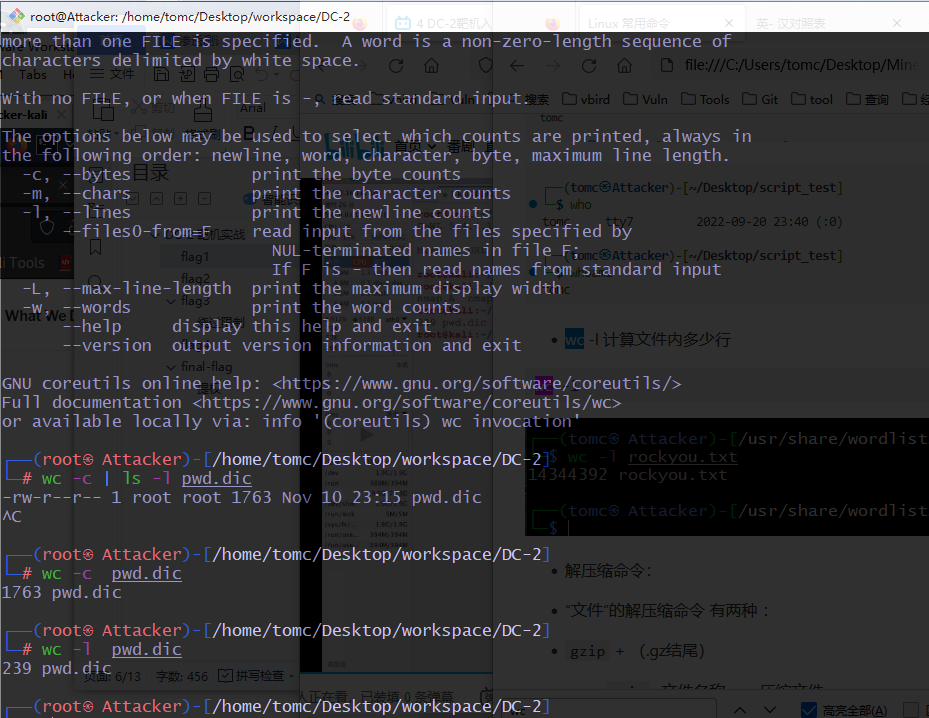

+ `vim` 用鼠标粘贴复制

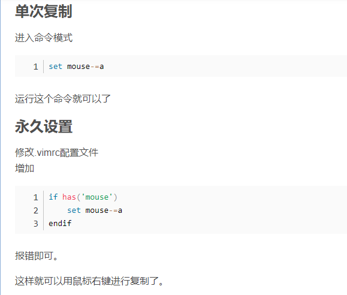


+ 测试本机在公网上的IP（cip.cc 中国一个小站）

`curl cip.cc `
+ 返回真实IP地址

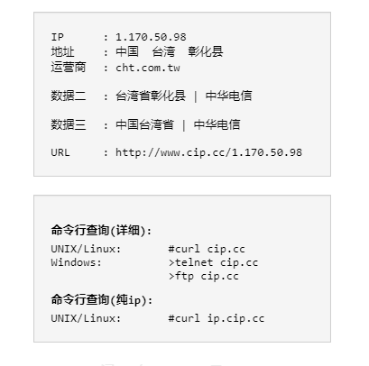

### 命令行的移动和快捷操作
```bash
	ctr+a (home键)移到头

	ctr+e （end 键）移到尾

	alt+f 左移一个单词

	alt+b 右移一个单词

	ctr+w 删左词

	alt+d 删右词

	ctrl+u 删到头

	ctr+k 删到尾 
```
---

*待续*

----

---

**未完**

---

### 参考资料
* [Github网络安全链接](https://github.com/c4pr1c3/cuc-ns)

