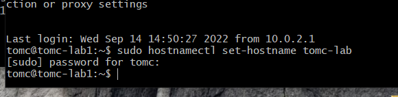
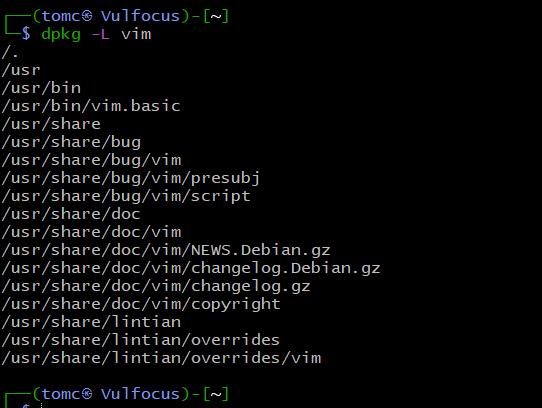
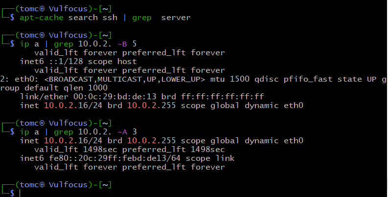
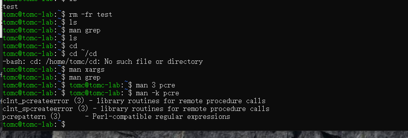
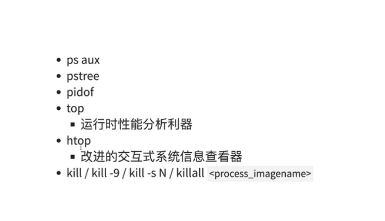
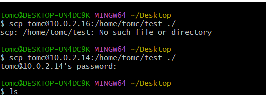
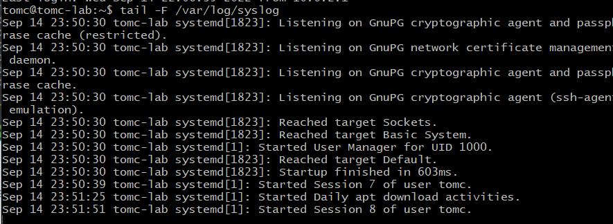
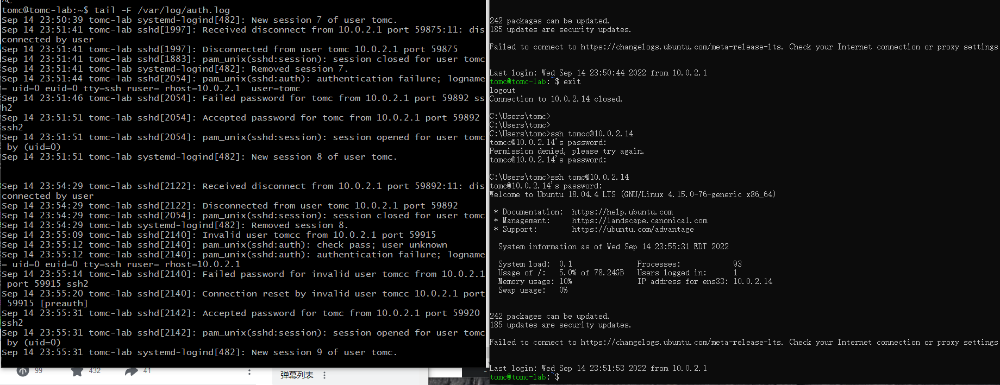
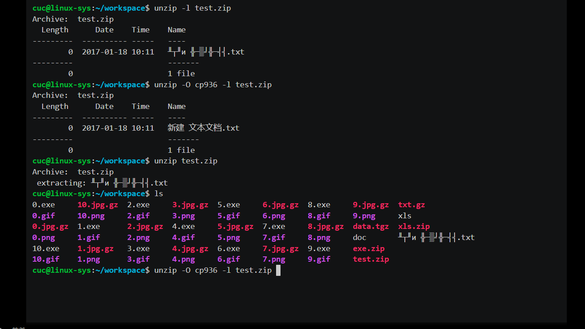

## Linux 常用命令

+ 修改主机名

```bash
#  test为修改后的主机名

hostnamectl set-hostname   test
```



+ 查看文件安装目录
  
```bash
dpkg -L vim
```



+ grep 
  
```bash
# 后接相应参数
grep -B    grep -A   grep -i   grep -n  grep -c
```



+ 查看系统版本几种方法
  
  ```bash
  # 针对ubuntu 系统 全部可用， 其他系统自行尝试
   cat /etc/issue 
   cat /etc/os-release
   cat /etc/lsb-release
  ```

+ man的几种方式

```bash
# 数字3 可为1- 9中的数字（需按实际替换）
man 3 pcre
```



 man 7 查看后 按q 退出 ，会提示还有可看文档  如果查看 按 回车 ，否则，按quit 退出

 

 + 进程常用指令
  
  ```bash
  ps aux  
  pstree  
  pidof  
  top
  htop
  kill/kill -9 / kill -s N /killall <process_imagename>   
  ```

  

  + scp
   
  ```bash
  #scp  源目标   目的目标 
  # 把远程主机10.0.2.14上的test文件 ，拷贝到本地 根目标  
  #注意 冒号  和 空格 

  scp tomc@10.0.2.14:/home/tomc/test ./
  ```

  

  + tail 时时监听syslog 日志

```bash
tail -F /var/log/syslog
tail -F /var/log/auth.log
```




+ Linux 系统中解压 来自Windows的压缩文件 乱码问题  

```bash
# 添加 大写字母O cp936 即可实现转码显示

unzip -l test.zip
unzip -O cp936 -l test.zip
```



---

*待续*

----

---

**未完**

---

### 参考资料
* [Github网络安全链接](https://github.com/c4pr1c3/cuc-ns)

