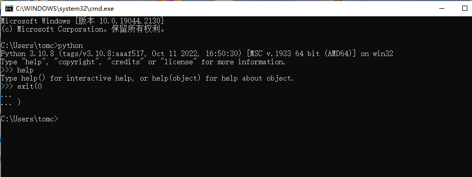
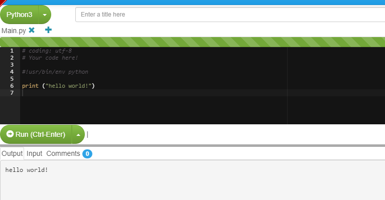
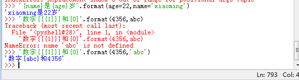
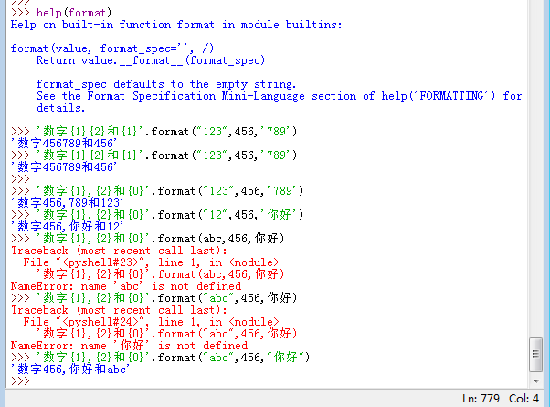
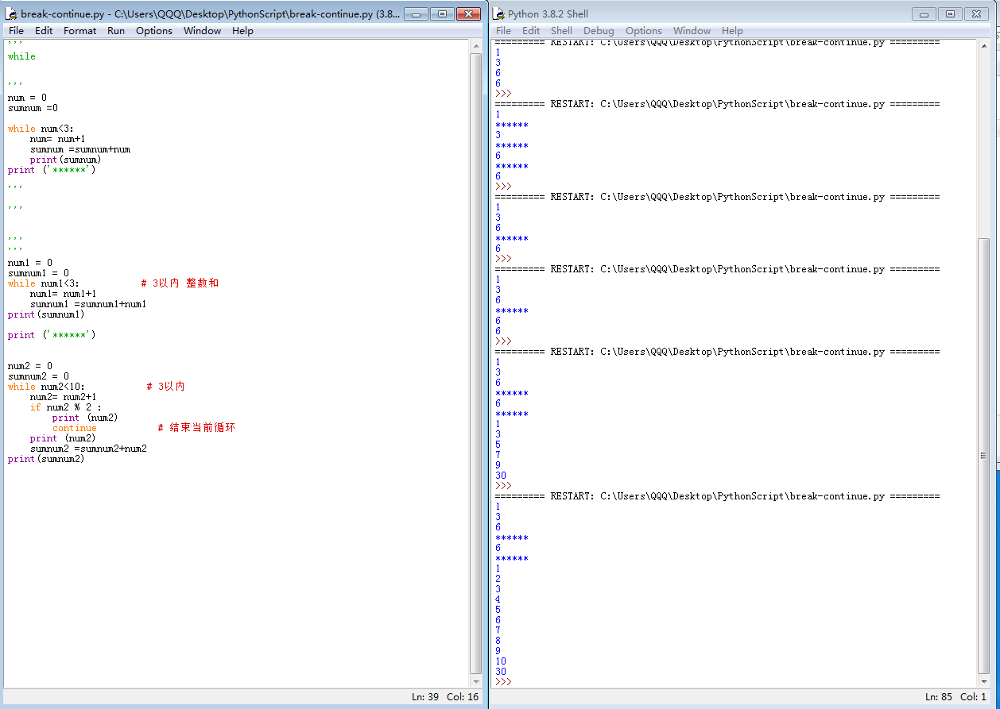
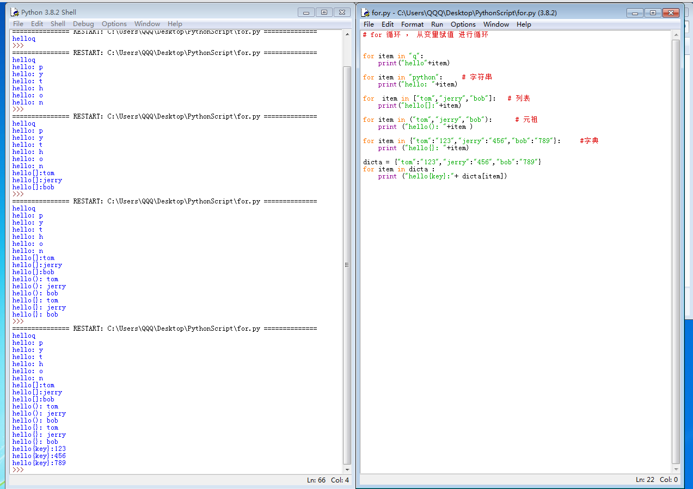

## Python3 指令

+ windows系统 

```python 
 +win键 +r  输入 cmd  

输入 python 
  进入 python 环境 

 +按  exit（） 退出Python  环境 释放内存空间  
```



+ 定制的脚本头部
   #!/usr/bin/env   python



+ alt+p  调出上一次执行的指令 

+ ctrl+z 撤销执行

+ 子语句需要缩进

+  类   属性 方法 
```python    
   class  类名（object）：
   # 属性 （变量）
       a = ""  
    # 方法 （函数）
     def  move():	
 # 创建对象
  mapro = 类名（“属性”）
  mapro.move()
	
```
+ fromat 格式：



```python
“数字{1}，字母{3}，汉字{2}”.format(123,'abc',‘你好’)     #  注意  处理数字 ，均为字符串需要用双引号或者单引号包围 

 '{name}是{age}岁'.format(age=22,name='xiaoming')    # 可以通过添加关键参数

'数字{{{1}}}和{0}'.format(4356,'abc')          # 有两层大括号的，输出的结果只有一层大括号 
```



+ 循环语句：
```python
while Ture:
       执行语句 
       break
num=0
while  num<3:                # 循环3次，根据条件循环 ，条件循环语句， 条件满足就进行循环
	执行子语句
	num = num+1
	break               # break 立即跳出循环 ， while 语句用 break 较多 

while num<10:
	num=num+1
	print (num)
	if num ==5 
	break


if  条件语句1：                     # 如果if 条件语句1 成立 执行 子语句1 .如果1不成立，检测条件语句2 ，如果成立 执行                                            # 子语句2 ，以上条件语句都不成立，则执行 子语句3
       子语句1
elif 条件语句2：
       子语句2
else：
      子语句3 

+  continue            # 结束当前循环，进行下一次循环 
```

```python
num = 0
sumnum =0

while num<3:
    num= num+1
    sumnum =sumnum+num
    print(sumnum)          
print ('******')
```

```python
num1 = 0
sumnum1 = 0
while num1<3:           # 3以内 整数和 
    num1= num1+1
    sumnum1 =sumnum1+num1
print(sumnum1)

print ('******')


num2 = 0
sumnum2 = 0
while num2<10:           # 3以内 
    num2= num2+1
    if num2 % 2 :
        print (num2) 
        continue           # 结束当前循环
    print (num2)
    sumnum2 =sumnum2+num2
print(sumnum2)
```



+ for 循环 ， 从变量赋值 进行循环  




```python
for item in "q":
    print("hello"+item)

for item in "python":     # 字符串
    print("hello: "+item)

for  item in ["tom","jerry","bob"]:   # 列表
    print("hello[]:"+item)

for item in ("tom","jerry","bob"):      # 元祖
    print ("hello(): "+item )

for item in {"tom":"123","jerry":"456","bob":"789"}:     #字典　
    print ("hello{}: "+item)

dicta = {"tom":"123","jerry":"456","bob":"789"}
for item in dicta :
    print ("hello{key}:"+ dicta[item])

sumn = 0
for item in range(0,11):    # 10 以内　偶数和，　或者　　基数和
　　item += 1
    if item % 2 :
        continue
    print (item)
    sumn += item
    print (sumn)
    
```


+ 一个等号(=) 是赋值 ，两个等号(==) 是 等
于 

+ forexmple:
```python
    num = num+1      # 右边先执行，是把  num+1 的 值 赋给  num    也可以用  num+=1
```

+ 正则表达式  
+  re 模块 的应用， 使用re 模块中的  findall  函数 
```python
>>> import re 

一、字符匹配

1、. 点 匹配单个任意字符
>>> re.findall(".ood"," i say Good no food")
['Good', 'food']

2、[] 中括号   逐一匹配中括号中的内容
>>> re.findall("[Gf]ood"," i say Good no food")
['Good', 'food']

3、\d   匹配单个数字
>>> re.findall("\d"," i am 40")
['4', '0']

3.1 \d\d   匹配两个数字
>>> re.findall("\d\d"," i am 40")
['40']

4、\w    匹配 [0-9][a-z][A-Z]
>>> re.findall("\w"," i say Good no food")
['i', 's', 'a', 'y', 'G', 'o', 'o', 'd', 'n', 'o', 'f', 'o', 'o', 'd']

5、\s    匹配空白字符  空格   tab 键
>>> re.findall("\s"," i say Good no food")
[' ', ' ', ' ', ' ', ' ']
s

二、 匹配一组字符串

1、直接匹配
>>> re.findall("Good"," i say Good no food")
['Good']

2、分隔符的 应用， 匹配两个不同的字符串
>>> re.findall("Good|food"," i say Good no food")
['Good', 'food']

3、* 号    匹配左邻字符出现0次或者多次
>>> re.findall("go*gle"," i like google not ggle goooogle and gogle")
['google', 'ggle', 'goooogle', 'gogle']

4、+号   匹配左邻字符出现一次或多次
>>> re.findall("go+gle"," i like google not ggle goooogle and gogle")
['google', 'goooogle', 'gogle']

5、？号  匹配左邻字符出现0次或一次
>>> re.findall("go?gle"," i like google not ggle goooogle and gogle")
['ggle', 'gogle']

6、{}大括号  匹配左邻字符出现2次
>>> re.findall("go{2}gle"," i like google not ggle goooogle and gogle")
['google']

7、{}大括号  匹配左邻字符 个数范围
>>> re.findall("go{2,10}gle"," i like google not ggle goooogle and gogle")
['google', 'goooogle']
>>> re.findall("go{2,3}gle"," i like google not ggle goooogle and gogle")
['google']

8、^  以此内容开头 进行匹配
>>> re.findall("^i like"," i like google not ggle goooogle and gogle")
[]
>>> re.findall("^ i like"," i like google not ggle goooogle and gogle")
[' i like']

9、$    以什么内容结尾 进行匹配
>>> re.findall("gogle$"," i like google not ggle goooogle and gogle")
['gogle']
>>> re.findall("google$"," i like google not ggle goooogle and gogle")
[]

10、 （） 与  \  配合使用  分组保存                 第一个\ 转义符， 第二个\1 意思是 分两组 
>>> test = re.search("(allen)\\1"," my nmae is allenallen ")
>>> test.group()
'allenallen'
 
 #  第一个allen 是一个小括号分一组， 第二个Allen  是，\1 保存一次， 拼接一起 得 ‘allenallen’

 ```


+ 查看 类型  `type()`
```python
type (list)    # 查看列表类型
type (tuple)   # 元组类型
type (dict)    # 字典类型
```
```python
help (list)   # 查看列表帮助信息
``` 